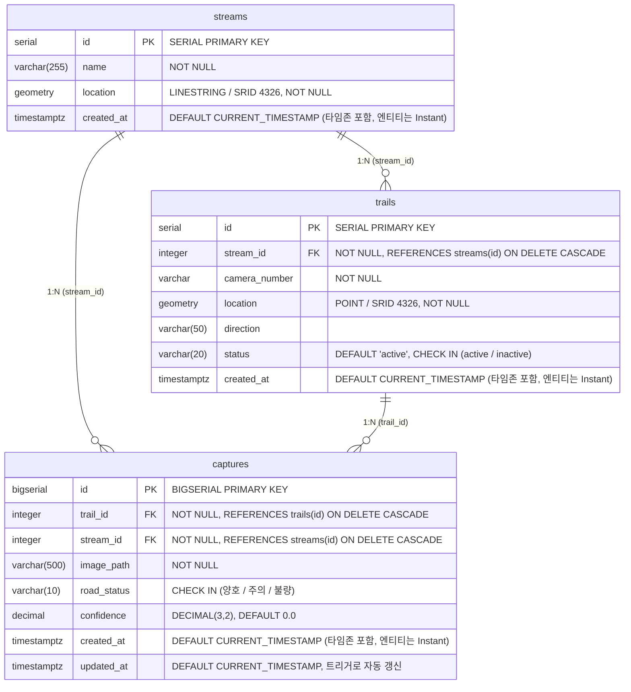

# Stream Walkway ERD

`infra/scripts/init-db.sql` 의 스키마를 다이어그램으로 표현한 문서입니다.
**스키마 변경 시 `init-db.sql` 과 이 문서를 함께 수정해 주세요.**

## 관계도

## 제약조건

Mermaid ER 문법으로 표현되지 않는 항목입니다.

| 테이블 | 종류 | 내용 |
|---|---|---|
| `trails` | UNIQUE | `(stream_id, camera_number)` — 한 하천 내 카메라 번호 중복 방지 |
| `trails` | CHECK | `status IN ('active', 'inactive')` |
| `captures` | CHECK | `road_status IN ('양호', '주의', '불량')` |
| `captures` | TRIGGER | `update_captures_updated_at` (BEFORE UPDATE) → `updated_at` 자동 갱신 |

> PostgreSQL에는 MySQL의 `ENUM` 타입과 `ON UPDATE CURRENT_TIMESTAMP` 문법이 없어
> 각각 `VARCHAR + CHECK` 와 트리거 함수(`update_updated_at_column()`)로 구현했습니다.

## 인덱스

| 인덱스명 | 대상 | 목적 |
|---|---|---|
| `idx_trails_stream_id` | `trails(stream_id)` | 하천별 산책길 조회 (`GET /api/trails?stream_id=`) |
| `idx_captures_trail_id` | `captures(trail_id)` | 산책길별 캡처 조회 |
| `idx_captures_stream_id` | `captures(stream_id)` | 하천별 캡처 조회 |
| `idx_captures_created_at` | `captures(created_at)` | 최신순 정렬 (`sort=created_at`) |

## 설계 노트

- **PostGIS 필수** — `location` 컬럼이 `GEOMETRY` 타입이므로 DB 초기화 시 `CREATE EXTENSION postgis` 가 먼저 실행되어야 합니다. SRID 4326은 WGS84(GPS 위경도) 기준입니다.
- **`captures.stream_id` 는 비정규화** — `trail_id → trails.stream_id` 로 조회 가능하지만, 하천 단위 조회가 잦아 JOIN을 피하려고 중복 보관합니다. 따라서 트레일을 다른 하천으로 옮기는 경우 `captures.stream_id` 도 함께 갱신해야 정합성이 유지됩니다.
- **CASCADE 삭제** — 하천 삭제 시 소속 트레일과 캡처가 모두 함께 삭제됩니다.
- **timestamp 컬럼은 `TIMESTAMPTZ`** — 자바 엔티티의 `createdAt`이 `Instant`(시점 타입)이므로, 타임존 정보를 보관하지 않는 `TIMESTAMP`가 아니라 `TIMESTAMPTZ`를 씁니다. 이렇게 해야 API 응답의 `created_at`이 `2024-01-01T00:00:00Z`처럼 타임존이 명시된 ISO-8601 형식으로 나갑니다.
